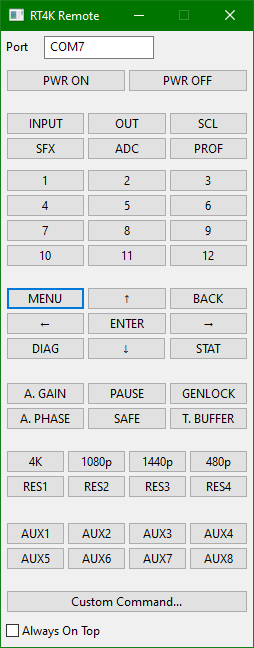

# RetroTINK-4K Remote



A rudimentary recreation of the [RetroTINK-4K](https://www.retrotink.com/product-page/retrotink-4k) remote control that issues commands over USB serial, written in wxPython.

## Instructions

[RetroTINK-4K firmware 1.6.6 or newer](https://retrotink-llc.github.io/firmware/) is required, which adds support for [serial commands over USB](https://consolemods.org/wiki/AV:RetroTINK-4K#USB_Serial_Configuration).

Requires [wxPython](https://wxpython.org) and [PySerial](https://pyserial.readthedocs.io/en/latest/pyserial.html).

```shell
pip install wxPython
pip install pyserial
```

Connect the power of the RetroTINK-4K to your PC and enter its serial port in the Port field. The text in the Port field is saved to **config.json**.


## Known Issues

The SAFE button does not work as expected, as the firmware does not activate its function unless it is held down for at least 2 seconds on the real remote.